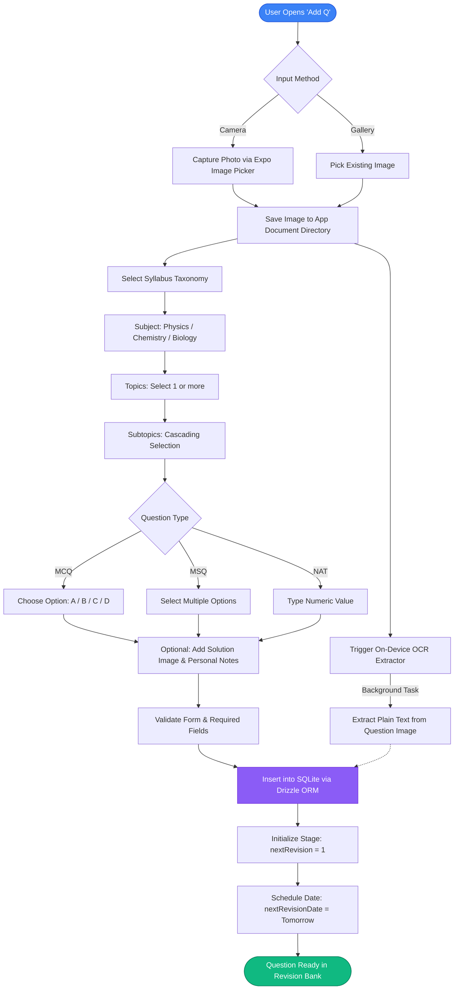
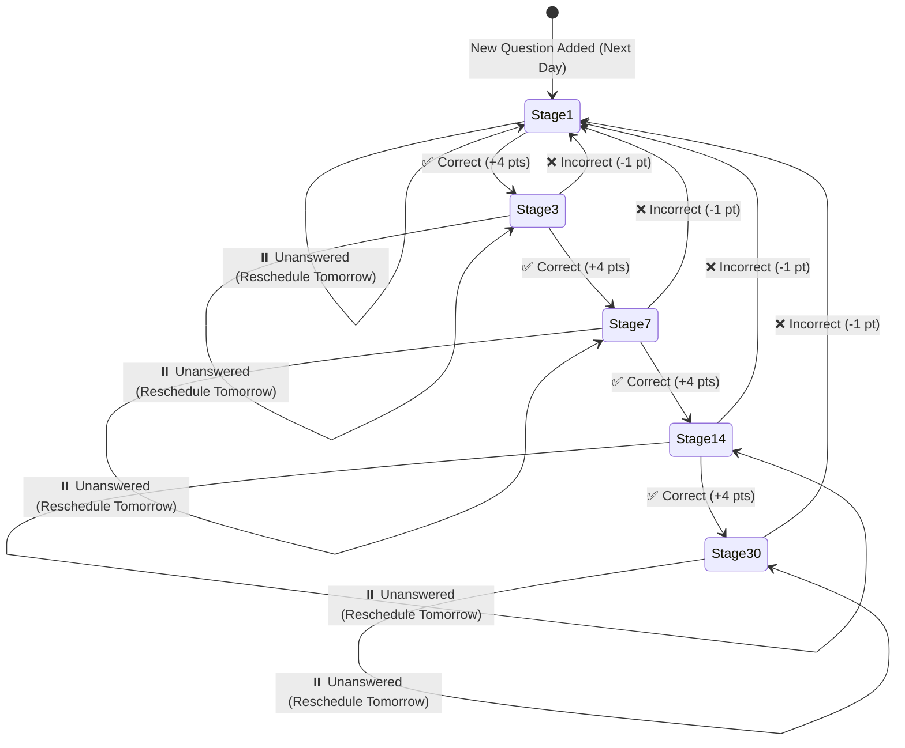
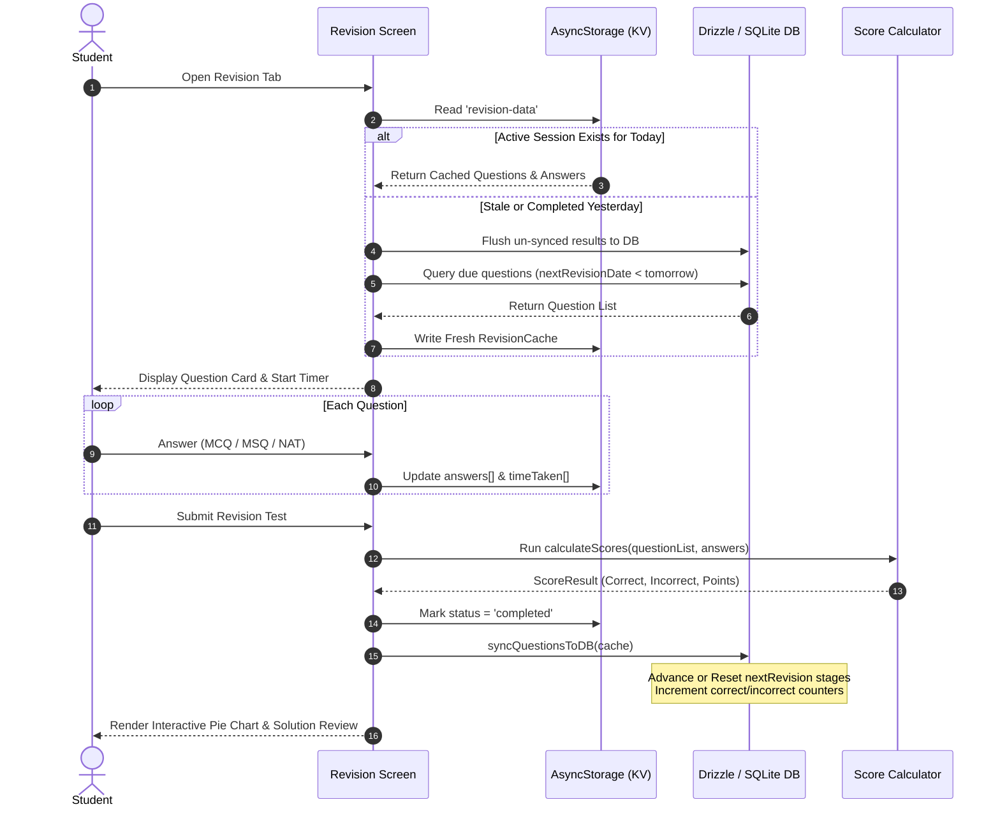

<div align="center">

# 🧠 Revision App `v1.0`

**An offline-first, intelligent spaced-repetition revision companion engineered for competitive exam mastery.**

[](https://docs.expo.dev/)
[](https://reactnative.dev/)
[](https://www.typescriptlang.org/)
[](https://orm.drizzle.team/)
[](https://docs.expo.dev/versions/latest/sdk/sqlite/)
[](#)

<br/>

<p align="center">
  Capture question papers, extract printed and handwritten problems via on-device OCR, categorize by exam taxonomy, and master difficult concepts using an automated <b>1 → 3 → 7 → 14 → 30 day</b> spaced-repetition algorithm.
</p>

</div>

---

## 🌟 What Revision App Does

Revision App transforms disorganized question clippings, exam mistakes, and study material into a scientific, high-retention revision cycle:

1. **Snap & Ingest**: Take photos of question sheets or mock tests using the camera or gallery. Store questions alongside full step-by-step solutions and custom study notes.
2. **Automatic OCR Indexing**: Automatically extracts printed and handwritten text using on-device optical character recognition (`@zhanziyang/expo-text-extractor`), enabling instant full-text keyword search across your entire question repository.
3. **Structured Exam Taxonomy**: Classifies every question using a hierarchical curriculum structure (**Subject → Topics → Subtopics**), pre-configured for rigorous competitive exams (e.g., NEET).
4. **Multiple Problem Types**:
   - **MCQ** (Single Option Correct: A, B, C, D)
   - **MSQ** (Multiple Options Correct with partial credit support)
   - **NAT** (Numerical Answer Type with precision matching)
5. **Automated Spaced Repetition (SRS)**: Automatically determines what you need to review today based on historical performance and memory decay curves.
6. **Simulated Exam Mode**: Timed revision sessions with individual question clocks, pinch-and-zoom image inspection, and competitive scoring (+4 correct, -1 negative marking).
7. **Two-Tier Session Recovery**: Revision sessions run inside an isolated `AsyncStorage` cache to safeguard against app restarts, flushing back to SQLite only upon test finalization.

---

## 🔄 System Workflows

### 1. Question Ingestion & OCR Workflow

The following flowchart illustrates how a problem is photographed, analyzed, indexed, and scheduled into the database:



---

### 2. Spaced Repetition Revision Cycle (SRS)

Revision App uses a **Fibonacci-style tiered spaced repetition curve**:
$$\text{Stages (in days)} = [1 \rightarrow 3 \rightarrow 7 \rightarrow 14 \rightarrow 30]$$

When a user reviews a question during a revision test, the scheduling engine evaluates the response and recalculates its position:



#### Revision Stage Rules:
- **`Correct`**: Advances the question to the next revision interval ($1 \rightarrow 3 \rightarrow 7 \rightarrow 14 \rightarrow 30$). Once at 30 days, the question is considered retained and recurs every 30 days.
- **`Incorrect`**: Immediately resets `nextRevision` back to **Stage 1 (1 day)**. This forces the student to confront their knowledge gap the very next day.
- **`Unanswered`**: Retains the current stage without penalty, pushing `nextRevisionDate` to tomorrow so the student can attempt it again.

---

### 3. Daily Revision Session Execution & Sync



---

## 📊 Scoring & Evaluation Engine

The scoring system is configured to simulate competitive entrance exams:

| Outcome | Point Delta | Spaced Repetition Effect | Description |
| :--- | :---: | :---: | :--- |
| **Correct** | `+4` | Advance Stage ($+1$) | Exact match for MCQ/NAT or complete match for MSQ |
| **Incorrect** | `-1` | Reset to Stage 1 | Wrong option picked, penalty applied |
| **Partial (MSQ)** | `+0` / partial | Reset to Stage 1 | Some correct options chosen, but incomplete set |
| **Unanswered** | `0` | Keep Current Stage | Rescheduled for next calendar day |

---

## 📁 Project Architecture

```plaintext
native-app/
├── assets/
│   ├── scores/
│   │   └── score.json             # Revision points configuration (+4 / -1 / 0)
│   └── syllabus/
│       └── neet.json              # Hierarchical syllabus taxonomy (Subject -> Topic -> Subtopic)
├── src/
│   ├── app/                       # Expo Router file-based screens
│   │   ├── (tabs)/
│   │   │   ├── _layout.tsx        # Glassmorphic bottom navigation with migration guard
│   │   │   ├── index.tsx          # Dashboard & SQLite connection status
│   │   │   ├── newQuestion/       # Question authoring form with camera & OCR
│   │   │   ├── revision/          # Timed test quiz interface & analytics
│   │   │   ├── search/            # Full-text & taxonomy filtered archive
│   │   │   └── settings/          # Application settings & maintenance
│   │   └── _layout.tsx            # Root layout
│   ├── components/
│   │   ├── revision/              # QuestionCard, ResultsPieChart, ImageZoomModal
│   │   ├── search/                # QuestionDetailModal with attempt statistics
│   │   ├── CollapsibleSection.tsx # Expandable form sections
│   │   ├── ImagePickerModal.tsx   # Native Camera / Gallery selection sheet
│   │   └── SyllabusDropdown.tsx   # Searchable cascading syllabus selector
│   ├── database/
│   │   ├── db.ts                  # Drizzle ORM client initialization
│   │   ├── migrator.ts            # Dynamic on-device migration runner
│   │   └── schema.ts              # SQLite table definitions (questions, intervals)
│   ├── functions/
│   │   ├── extractText.ts         # OCR text extraction engine
│   │   ├── queries.ts             # Question insertion and validation logic
│   │   ├── revisionQuestionFetch.ts # Daily question selector & cache manager
│   │   ├── scoreCalculator.ts     # Pure scoring function for MCQ, MSQ, and NAT
│   │   ├── searchQuestions.ts     # Multi-parameter & full-text search queries
│   │   └── syncQuestion.ts        # Spaced repetition advancement & DB flush
│   ├── hooks/
│   │   └── useImagePicker.ts      # Hardware camera & gallery permission hook
│   └── types/
│       ├── question.ts            # Form inputs, question types, and results
│       └── syllabus.ts            # Subject, topic, and subtopic types
├── app.json                       # Expo configuration & plugins
├── drizzle.config.ts              # Drizzle Kit migration configuration
└── package.json                   # Project dependencies and npm scripts
```

---

## 🚀 Getting Started

### Prerequisites
- Node.js (v18 or later)
- npm, yarn, or pnpm
- [Expo Go](https://expo.dev/go) on a physical mobile device, or an iOS Simulator / Android Emulator.

### Installation

1. **Clone the repository and navigate to the mobile app directory**:
   ```bash
   cd native-app
   ```

2. **Install project dependencies**:
   ```bash
   npm install
   ```

3. **Database Setup & Migrations**:
   Generate and push the initial database schema to SQLite:
   ```bash
   npm run db:generate
   ```

4. **Start the Development Server**:
   ```bash
   npx expo start
   ```

5. **Launch on Your Preferred Target**:
   - Press <kbd>a</kbd> for **Android** emulator / connected device.
   - Press <kbd>i</kbd> for **iOS** simulator.
   - Scan the QR code using the **Expo Go** app on your physical device.

---

## 📜 Available Scripts

| Command | Action |
| :--- | :--- |
| `npm run start` | Starts the Expo development bundler |
| `npm run android` | Launches the app in Android Studio emulator |
| `npm run ios` | Launches the app in Xcode iOS simulator |
| `npm run db:generate` | Generates Drizzle SQL migrations based on `schema.ts` |
| `npm run db:migrate` | Applies database migrations |
| `npm run db:push` | Pushes schema changes directly to SQLite database |
| `npm run db:studio` | Launches Drizzle Studio in browser for database inspection |
| `npm run lint` | Runs Expo ESLint checks |

---

<div align="center">
  <sub>Built with ❤️ for focused, high-efficiency revision.</sub>
</div>
