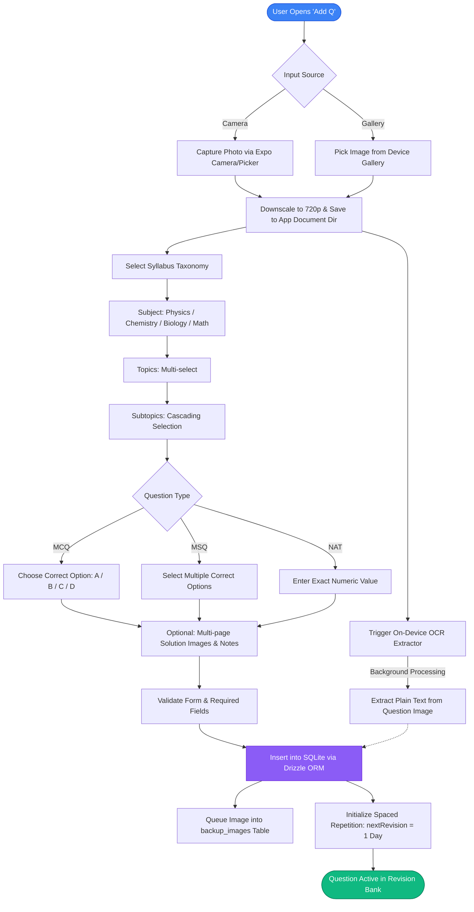
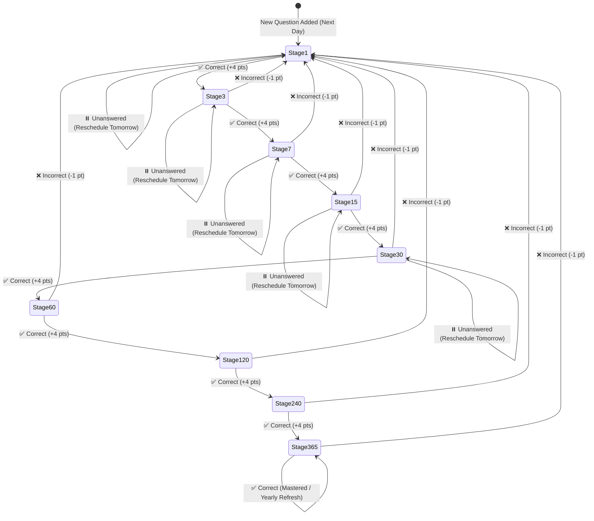
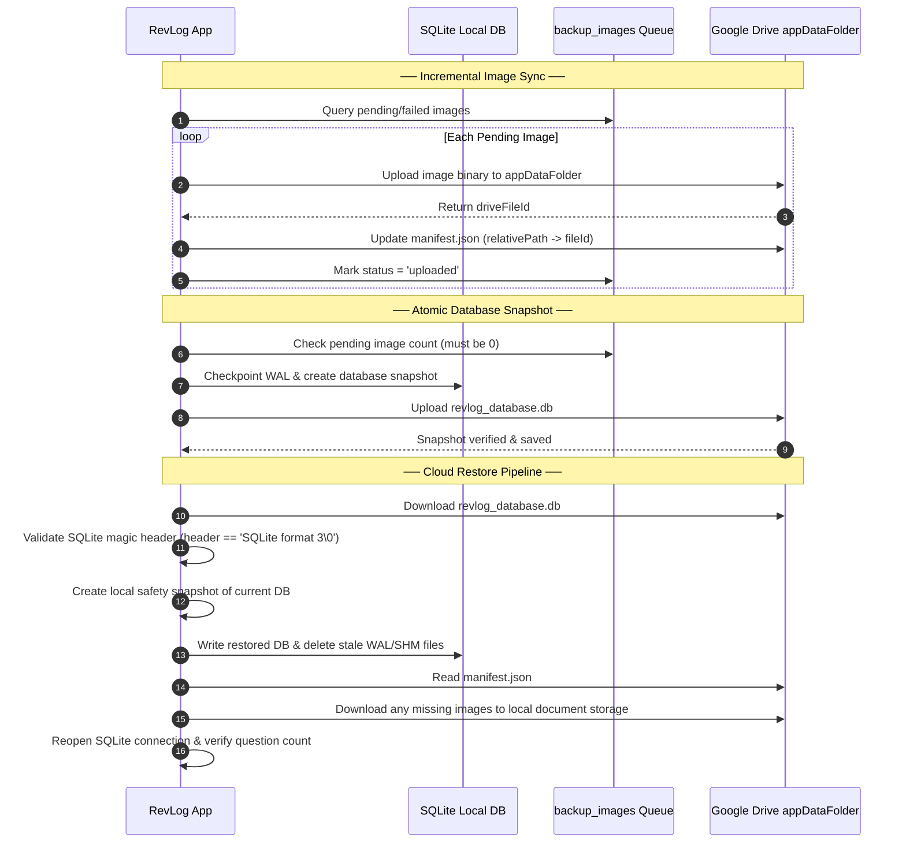

<div align="center">

# 🧠 RevLog `v1.2`

**An offline-first, intelligent spaced-repetition revision companion & question bank engineered for competitive exam mastery.**

[](https://docs.expo.dev/)
[](https://reactnative.dev/)
[](https://react.dev/)
[](https://www.typescriptlang.org/)
[](https://orm.drizzle.team/)
[](https://docs.expo.dev/versions/latest/sdk/sqlite/)
[](#-cloud-backup--sync)
[](#-over-the-air-ota-updates)
[](#)

<br/>

<p align="center">
  Capture question papers, extract printed and handwritten text via on-device OCR, categorize by exam taxonomy, and master difficult concepts using an automated <b>1 → 3 → 7 → 15 → 30 → 60 → 120 → 240 → 365 day</b> spaced-repetition algorithm with Google Drive cloud backup.
</p>

</div>

---

## 🌟 Key Capabilities & Highlights

RevLog transforms disorganized mock tests, exam mistakes, and study material into a scientific, high-retention revision bank:

1. **Snap, Crop & Ingest**:
   - Multi-page camera and gallery ingestion for both questions and complete step-by-step solutions.
   - Automatic 720p image downscaling and persistence in local sandboxed storage.
2. **On-Device OCR & Keyword Search**:
   - Extracts printed and handwritten text using native on-device optical character recognition (`expo-text-extractor`).
   - Enables full-text search across question images, personal notes, and syllabus taxonomy without relying on external cloud APIs.
3. **Multi-Exam Taxonomy & Onboarding**:
   - Choose target competitive exams (**NEET, JEE Main, JEE Advanced**, etc.) with custom streams.
   - Dynamic 3-tier hierarchy (**Subject → Topics → Subtopics**) with cascading multi-select dropdowns.
4. **Multiple Problem Types**:
   - **MCQ** (Single option correct: A, B, C, D)
   - **MSQ** (Multiple options correct with complete validation)
   - **NAT** (Numerical Answer Type with precision matching)
5. **Full Question Management (View, Edit & Delete)**:
   - **Compact List Cards**: Clean cards displaying subject color tags, 2-line OCR preview text, and historical accuracy scores.
   - **Detail Analytics Modal**: Displays revision performance charts, total attempts, stage intervals, pinch-to-zoom images, and solutions.
   - **Edit Question**: Full editor modal to modify syllabus, question/solution images, problem type, correct answers, OCR text, and notes.
   - **Slick Delete Confirmation**: Ultra-compact, themed in-app dialog (no system alert) that safely purges the question, cleans up local image files, and removes pending backup queue items.
6. **Spaced Repetition Revision Cycle (SRS)**:
   - Automated memory-decay scheduling: `[1 → 3 → 7 → 15 → 30 → 60 → 120 → 240 → 365]` days.
   - Advances interval upon correct answers, resets to Stage 1 upon errors, and reschedules for tomorrow if skipped.
7. **Simulated Exam Mode**:
   - Timed revision sessions with individual question clocks, pinch-to-zoom image inspection, and competitive scoring (+4 correct, -1 negative marking).
   - Session recovery via `AsyncStorage` caching to protect against app restarts.
8. **Google Drive Cloud Sync & Backups**:
   - Secure Google Sign-In with OAuth 2.0 (`@react-native-google-signin/google-signin`).
   - Backs up directly to the user's isolated, private Google Drive `appDataFolder`.
   - Standalone SQLite database snapshots (`revlog_database.db`) with WAL flushing and magic header verification.
   - Incremental background image sync queue (`backup_images` table) with configurable network rules (Wi-Fi only vs Cellular).
   - One-tap cloud restore with safety snapshots and automated rollback protection.
9. **Over-The-Air (OTA) Updates**:
   - Real-time updates via EAS Update channels (`preview`, `production`).
   - In-app notification prompt when an update is downloaded and ready to apply.
10. **Theming & Aesthetics**:
    - Complete Dark and Light mode support with curated HSL color schemes, glassmorphic tab bars, and fluid layout animations.

---

## 🔄 System Architecture & Workflows

### 1. Question Ingestion & OCR Pipeline



---

### 2. Spaced Repetition Schedule (SRS)

RevLog follows a **9-tier exponential memory decay curve**:

$$\text{Intervals (in days)} = [1 \rightarrow 3 \rightarrow 7 \rightarrow 15 \rightarrow 30 \rightarrow 60 \rightarrow 120 \rightarrow 240 \rightarrow 365]$$



#### Evaluation Rules:
* **`Correct`**: Advances to the next interval stage ($1 \rightarrow 3 \rightarrow \dots \rightarrow 365$). At 365 days, it repeats annually.
* **`Incorrect`**: Resets `nextRevision` immediately back to **Stage 1 (1 day)** so that weaknesses are addressed the next day.
* **`Unanswered`**: Keeps the current stage intact without penalty and reschedules for tomorrow.

---

### 3. Google Drive Backup & Recovery Architecture



---

## 📊 Scoring & Evaluation Engine

The revision session simulates competitive entrance exams:

| Outcome | Points | SRS Spaced Repetition Effect | Behavior |
| :--- | :---: | :---: | :--- |
| **Correct** | `+4` | Advance Stage ($+1$) | Exact match for MCQ/NAT or all correct options for MSQ |
| **Incorrect** | `-1` | Reset to Stage 1 | Wrong option picked, negative penalty applied |
| **Partial (MSQ)** | `0` / partial | Reset to Stage 1 | Subset of correct options picked without wrong ones |
| **Unanswered** | `0` | Retain Current Stage | Pushed to tomorrow for another attempt |

---

## 📁 Directory Structure

```plaintext
native-app/
├── assets/
│   ├── images/                    # App icons, splash screens, and branding
│   ├── logo/                      # Vector & high-res RevLog logos
│   ├── scores/
│   │   └── score.json             # Points & marking scheme configuration
│   └── syllabus/                  # Comprehensive syllabus taxonomies (NEET, JEE, etc.)
├── drizzle/                       # Generated Drizzle SQL migration files
├── src/
│   ├── app/                       # File-based routing (Expo Router)
│   │   ├── (tabs)/
│   │   │   ├── _layout.tsx        # Bottom tab bar with active badge indicators
│   │   │   ├── index.tsx          # Dashboard with overall analytics & sync status
│   │   │   ├── newQuestion/       # Question authoring form with camera & OCR
│   │   │   ├── revision/          # Timed revision quiz session & analytics
│   │   │   ├── search/            # Full-text OCR search, card list, & filters
│   │   │   └── settings/          # Google Drive sync, theme, and maintenance
│   │   └── _layout.tsx            # Root layout, theme provider, and OTA listener
│   ├── components/
│   │   ├── revision/              # QuestionCard, ResultsPieChart, ImageZoomModal
│   │   ├── search/
│   │   │   ├── DeleteQuestionModal.tsx  # Sleek, compact deletion confirmation
│   │   │   ├── EditQuestionModal.tsx    # Comprehensive question & solution editor
│   │   │   └── QuestionDetailModal.tsx  # Full question breakdown with stats & actions
│   │   ├── settings/
│   │   │   ├── GoogleDriveCard.tsx       # Cloud account linkage & sync triggers
│   │   │   └── LogoutConfirmationModal.tsx # Drive logout confirmation
│   │   ├── CollapsibleSection.tsx       # Animated expandable section container
│   │   ├── ImagePickerModal.tsx         # Camera / Gallery selection sheet
│   │   ├── OnboardingModal.tsx          # Target exam & stream configuration
│   │   ├── OtaUpdateNotification.tsx    # In-app update notification banner
│   │   ├── StatusModal.tsx              # Reusable success/error/warning alerts
│   │   └── SyllabusDropdown.tsx         # Searchable cascading syllabus picker
│   ├── config/
│   │   └── exams.ts               # Supported exams and syllabus mapping
│   ├── constants/
│   │   └── theme.ts               # Dark and light color design tokens
│   ├── context/
│   │   ├── CloudSyncContext.tsx   # Google Drive sync state and triggers
│   │   ├── ExamContext.tsx        # Active exam and syllabus selection
│   │   └── ThemeContext.tsx       # System / Dark / Light theme provider
│   ├── database/
│   │   ├── db.ts                  # Drizzle ORM client initialization
│   │   ├── migrator.ts            # Dynamic on-device migration runner
│   │   └── schema.ts              # SQLite tables (questions, backup_images, settings)
│   ├── functions/
│   │   ├── backfillExtractedText.ts # Background OCR backfill worker
│   │   ├── dashboardStats.ts      # Metrics and streak calculations
│   │   ├── extractText.ts         # Native OCR text extraction
│   │   ├── imageHelpers.ts        # URI resolution and path normalization
│   │   ├── queries.ts             # CRUD operations (insert, update, delete)
│   │   ├── resizeImage.ts         # 720p image downscaling utility
│   │   ├── revisionQuestionFetch.ts # Daily questions fetcher & cache manager
│   │   ├── scoreCalculator.ts     # Exam scoring rules engine
│   │   ├── searchQuestions.ts     # Full-text & taxonomy search engine
│   │   └── syncQuestion.ts        # Revision session synchronization to SQLite
│   ├── hooks/
│   │   ├── useImagePicker.ts      # Camera/gallery capture & persistent storage
│   │   └── useOtaUpdates.ts       # EAS Update listener and downloader
│   ├── services/
│   │   ├── backupService.ts       # Sync & restore orchestrator
│   │   ├── backupSettingsRepo.ts  # Wi-Fi only & auto-sync preferences
│   │   ├── googleAuth.ts          # Google OAuth 2.0 authentication
│   │   ├── googleDrive.ts         # Google Drive appDataFolder REST client
│   │   └── imageBackupRepo.ts     # Pending image queue queries
│   └── types/
│       ├── question.ts            # Question forms, types, and attempt results
│       └── syllabus.ts            # Syllabus taxonomy schemas
├── app.json                       # Expo configuration, plugins, and EAS project ID
├── eas.json                       # EAS Build & Update profiles (preview, production)
├── drizzle.config.ts              # Drizzle Kit migration configuration
└── package.json                   # Project dependencies and npm scripts
```

---

## 🚀 Getting Started

### Prerequisites
- **Node.js**: v18 or later
- **Package Manager**: `pnpm` (recommended), `npm`, or `yarn`
- **Development Client**: An Android device/emulator or iOS simulator running a custom dev build (`expo-dev-client`) for native OCR and Google Sign-In support.

### Setup & Run

1. **Clone the repository**:
   ```bash
   git clone https://github.com/Ayandi999/revision-app.git 
   cd revision-app
   ```

2. **Install dependencies**:
   ```bash
   pnpm install
   ```

3. **Configure Environment Variables**:
   Create a `.env` file in the `native-app` root directory:
   ```env
   EXPO_PUBLIC_GOOGLE_WEB_CLIENT_ID=your-google-oauth-web-client-id.apps.googleusercontent.com
   ```

4. **Generate Database Migrations**:
   ```bash
   pnpm run db:generate
   ```

5. **Start Metro Development Server**:
   ```bash
   pnpm start
   ```

6. **Run on Android**:
   ```bash
   pnpm run android
   ```

---

## 📲 Over-The-Air (OTA) Updates

RevLog supports instant over-the-air updates via EAS Update. To publish updates to the `preview` or `production` channel:

```bash
# Push update to preview channel
npx eas-cli update --channel preview --platform android --environment preview --message "Description of changes"

# Push update to production channel
npx eas-cli update --channel production --platform android --environment production --message "Release v1.2"
```

---

## 📜 Available Scripts

| Command | Description |
| :--- | :--- |
| `pnpm start` | Starts the Expo development server with Metro bundler |
| `pnpm run android` | Builds and runs the app on an Android device/emulator |
| `pnpm run ios` | Builds and runs the app on an iOS simulator |
| `pnpm run db:generate` | Generates Drizzle SQL migrations from `schema.ts` |
| `pnpm run db:migrate` | Runs database migrations |
| `pnpm run db:push` | Pushes schema changes directly to SQLite database |
| `pnpm run db:studio` | Launches Drizzle Studio in your browser for database inspection |
| `pnpm run lint` | Runs ESLint code quality checks |

---

<div align="center">
  <sub>Built with ❤️ for focused, scientific exam preparation.</sub>
</div>
